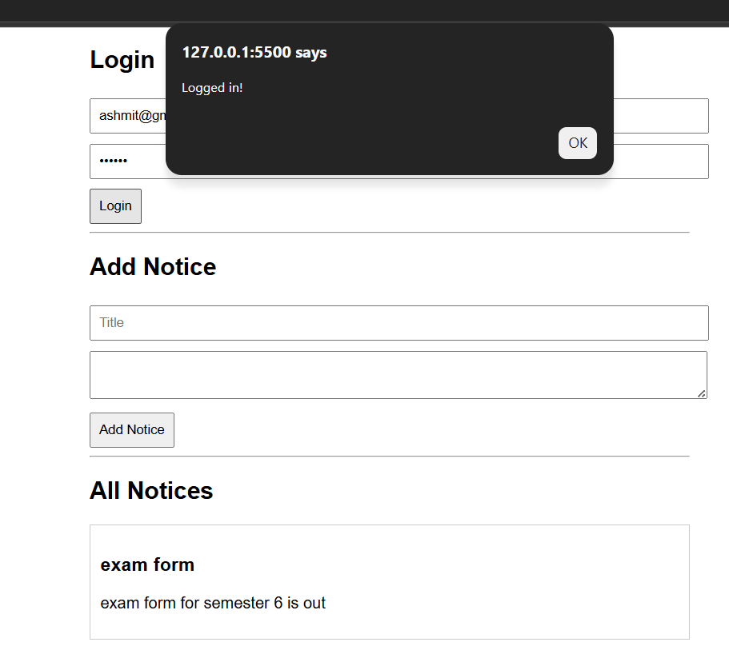
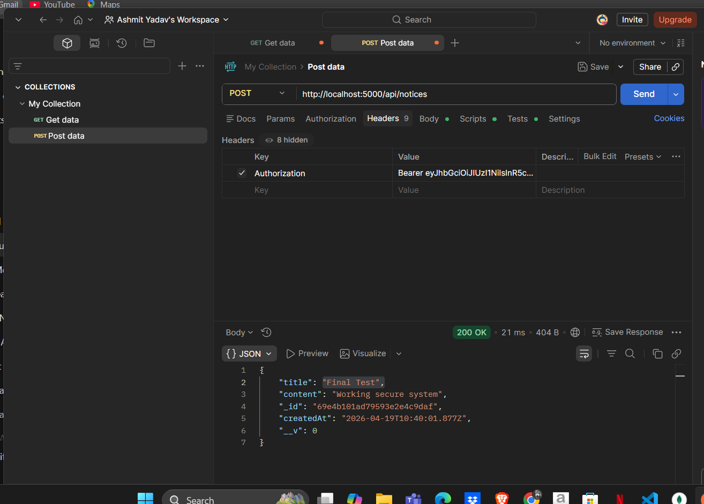

# 📢 College Notice Board System

## 🚀 Overview
A full-stack Notice Board system where:
- Admin can post notices
- Students can view notices
- Authentication & authorization implemented

---

## 🛠️ Tech Stack
- Node.js
- Express.js
- MongoDB
- HTML, CSS, JavaScript

---

## 🔐 Features
- User Registration & Login (JWT Auth)
- Role-based Access (Admin / Student)
- Only Admin can add notices
- Students can only view notices
- Secure API endpoints

---

## 📂 Project Structure
- Backend (Express + MongoDB)
- Frontend (Simple HTML UI)

---

## 🌟 Key Highlights
- JWT Authentication
- Role-based Authorization (Admin/Student)
- REST API Design
- Full-stack implementation
  

## ▶️ How to Run
```bash

1. Clone repo:
git clone YOUR_REPO_LINK
cd notice-board-app view them.

2.Install Dependencies
npm install

3.Add .env file
MONGO_URI=mongodb://127.0.0.1:27017/notesDB

4.Run server
node server.js

5.Open index.html

```

## 📸 Screenshots

### 🌐 Frontend UI


### 🔐 API Testing (Postman)

